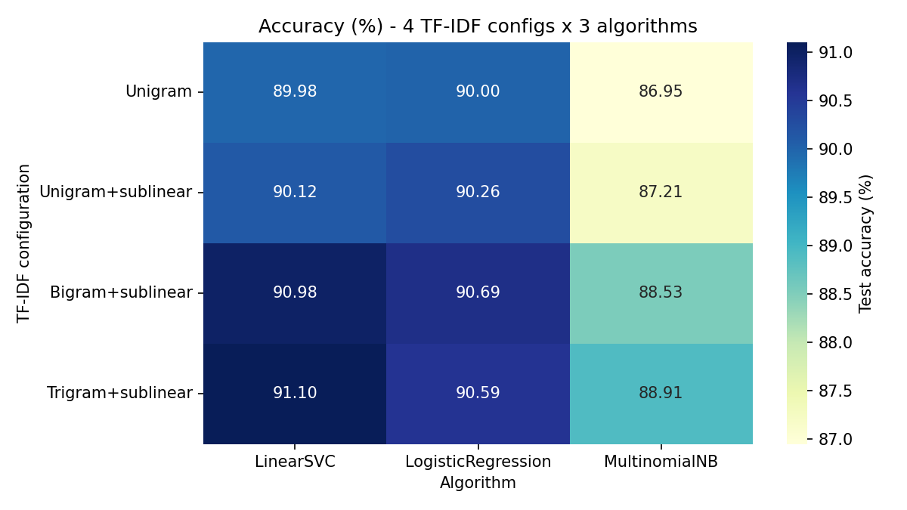
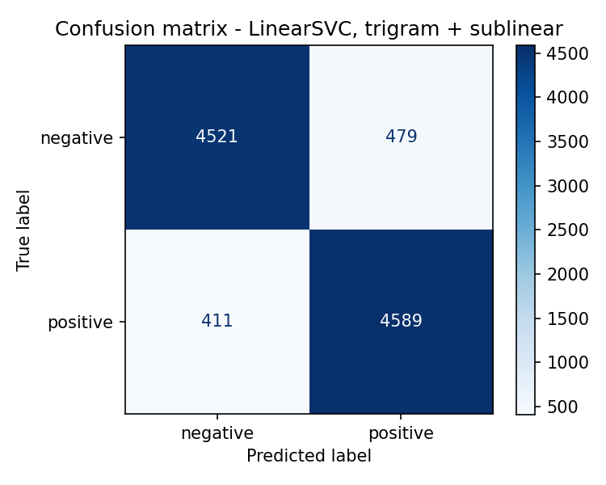
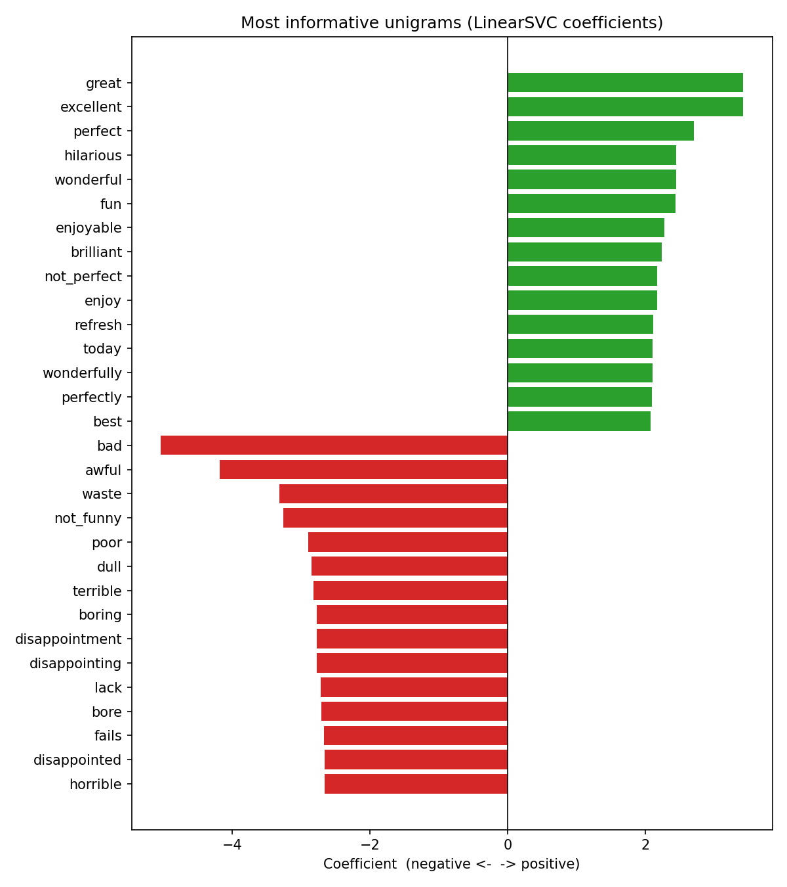
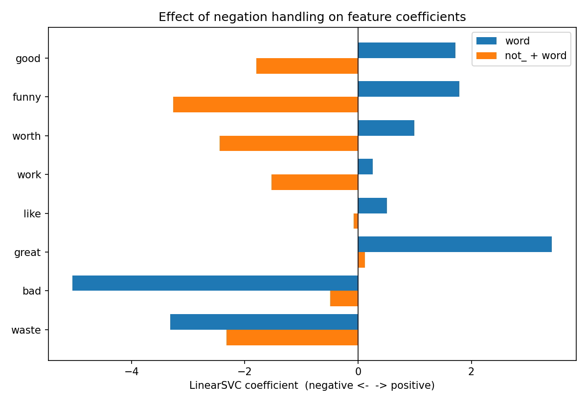

# Movie Review Sentiment Analysis (TF-IDF + SVM)

Binary sentiment classification (positive / negative) of 50,000 IMDB movie reviews using classical machine learning — TF-IDF features with LinearSVC, Logistic Regression, and Multinomial Naive Bayes.

## Dataset

[IMDB Dataset of 50K Movie Reviews](https://www.kaggle.com/datasets/lakshmi25npathi/imdb-dataset-of-50k-movie-reviews) (Kaggle), balanced 25,000 positive / 25,000 negative reviews. Originally from Stanford AI Lab (Maas et al., ACL 2011).

## Approach

1. **EDA** — class balance, review length distribution, top words/bigrams per class
2. **Preprocessing** — HTML tag removal, lowercasing, contraction expansion, negation handling (`not_x` tokens), stopword removal (keeping negation words), WordNet lemmatization
3. **TF-IDF features** — 4 configurations tested: unigram, unigram + sublinear TF, bigram, trigram + sublinear TF
4. **Models** — LinearSVC, Logistic Regression, Multinomial Naive Bayes (12 combinations total)
5. **Evaluation** — 80/20 stratified split, 5-fold cross-validation on best configuration, error analysis

## Results

### Accuracy across configurations

**Best result:** TF-IDF trigrams + sublinear TF + LinearSVC (C=1.0) — **91.10% test accuracy**, **90.69% ± 0.18%** (5-fold CV).

### Confusion Matrix

### Most informative words

Top TF-IDF features most strongly associated with positive and negative sentiment.

### Effect of negation handling

Comparing coefficients of plain words (e.g. `good`, `bad`) vs. their negated forms (`not_good`, `not_bad`) shows the model correctly learns opposite sentiment associations.

## Benchmark comparison

| Model | Accuracy |
|---|---|
| Stanford (Maas et al., 2011) | 88.89% |
| **This project (LinearSVC + trigrams)** | **91.10%** |
| Classical SVM + n-grams (literature) | ~93–94% |
| BERT (literature) | ~95–96% |

## Limitations

- Classical features (no context beyond n-grams) struggle with sarcasm and mixed-sentiment reviews
- Short reviews (<50 words) are harder to classify accurately than longer ones
- Genre-specific vocabulary (e.g. "terrifying" is positive in horror reviews) can mislead the model
- No deep learning / transformer comparison included in this phase

## Project structure
